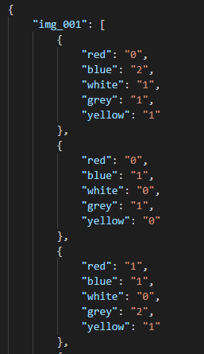

# Lego system
This repository contains a project on sensors and vision systems. The aim of the project was counting holes in group of the lego blocks of different shapes based on image. The colors of each object are described in states.json file.   

To run this program you have to type this command: \
$ `python imgs_path input_json_file_path output_json_file_path`

Where:
- img_path - path to the images directory
- input_json_file_path - path to the json file that contains a description of the objects
- output_json_file_path - path to the json file, which will be created by script. This file will be filled with a list of holes counted in each object.

|Input image|Input json file|Output json file|
|:---------:|:-------------:|:--------------:|
||||
