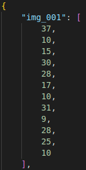

# Lego system
This repository contains a project on sensors and vision systems. The aim of the project was counting holes in group of the lego blocks of different shapes based on image. The colors of each object are described in states.json file.   

## Installation
```
$ pip3 install -r requirements.txt
```

## Running the program
Necessary paths have to be set in the config file. Config file is located in the main repository directory with name config.json. 

Paths to set:
- images_dir - path to the images directory
- description_file - path to the json file that contains a description of the objects
- output_file - path to the json file, which will be created by script. This file will be filled with a list of holes counted in each object.

After that you can type this command and run the program: \
$ `python Lego_system.py` 

|Input image|Input json file|Output json file|
|:---------:|:-------------:|:--------------:|
||||
